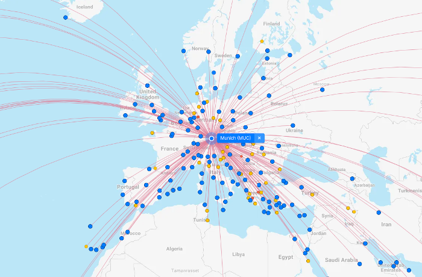

# Find the Cheapest Route

In this exercisee you will have to find the cheapest way to **reach the conference** by plane from your place of birth.

Luckily the Munich Airport (IATA: MUC) is very well connected, so you will be able to find an [aiport near your city of birth](https://www.flightconnections.com/flights-from-munich-muc).

## Point Breakdown

| **Points**      | **Challenge** |
| ----------- | ----------- |
| **5** | Find the cheapest route from a given airport to the conference |
| **8** | Find the cheapest route from the airport that is closest of your city of origin. _See [Airport Nearest Relevant](https://developers.amadeus.com/self-service/category/air/api-doc/airport-nearest-relevant)_ |
| **10** | Find the cheapest route from the airport that is closest of your city of origink and direct connection to Munich. _See [Airport Routes API](https://developers.amadeus.com/self-service/category/air/api-doc/airport-routes)_ |

## Getting started
You can retrieve your personal API key by following the [Quick Start Guide](https://alonsomoya.github.io/ama4dev/quick-start/)

## Choose your favorite weapon

We have a number of SDKs available to help you integrate Amadeus Self-Service APIs into your applications. To give more context to how each of the SDKs can be used, we also have a dedicated tutorial per programming language.

| **SDK source files**      | **SDK tutorial** |
| ----------- | ----------- |
| [Amadeus Node SDK](https://github.com/amadeus4dev/amadeus-node)| [Amadeus Node SDK tutorial](node-sdk.md) |
| [Amadeus Python SDK](https://github.com/amadeus4dev/amadeus-python)| [Amadeus Python SDK tutorial](python-sdk.md) |
| [Amadeus Java SDK](https://github.com/amadeus4dev/amadeus-node)| [Amadeus Java SDK tutorial](java-sdk.md) |

If you need an SDK in a different language, feel free to use the [OpenAPI Generator](https://openapi-generator.tech/) to automatically create an SDK from our [OpenAPI Specification files](https://github.com/amadeus4dev/amadeus-open-api-specification). We also have a [tutorial](openapi-generator.md) on how to do this.

